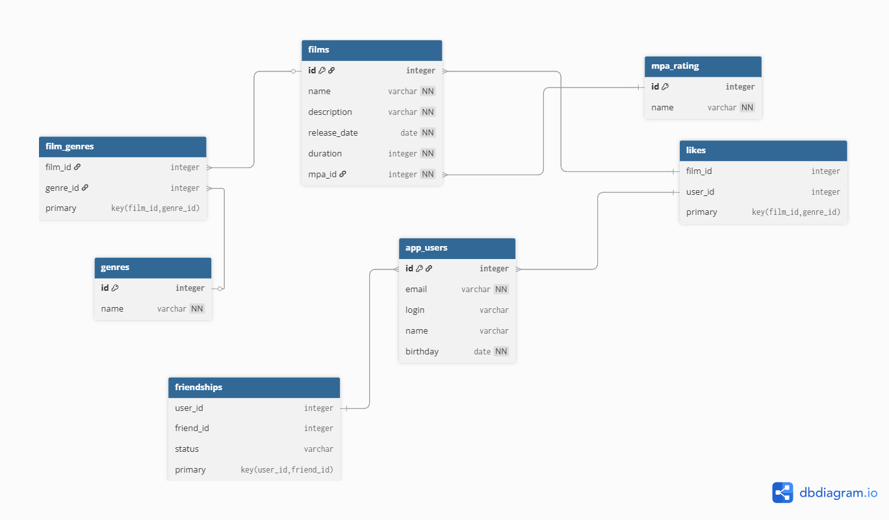

# java-filmorate
Template repository for Filmorate project.

# Filmorate

## Схема базы данных

Полный файл диаграммы в формате dbml: [filmorate.dbml](docs/filmorate.dbml)

### Пояснения
- Таблица `users` хранит информацию о пользователях.
- Таблица `films` хранит информацию о фильмах и содержит ссылку на рейтинг MPA.
- Таблица `genres` и промежуточная таблица `film_genres` реализуют связь "многие-ко-многим".
- Таблица `likes` позволяет учитывать лайки фильмов пользователями.
- Таблица `friendships` реализует "дружбу" между пользователями с возможностью статуса (PENDING, CONFIRMED).


## Примеры SQL-запросов

### Получить все фильмы
```sql
SELECT * 
FROM films;
```

### Получить всех пользователей
```sql
SELECT * 
FROM users;
```

### Найти топ-5 самых популярных фильмов (по количеству лайков)
```sql
SELECT f.id, f.name, COUNT(l.user_id) AS likes_count
FROM films f
LEFT JOIN likes l ON f.id = l.film_id
GROUP BY f.id, f.name
ORDER BY likes_count DESC
LIMIT 5;
```

### Получить список друзей пользователя
```sql
SELECT u.id, u.name, fs.status
FROM friendships fs
JOIN users u ON fs.friend_id = u.id
WHERE fs.user_id = 1;
```

### Получить общих друзей двух пользователей
```sql
SELECT u.id, u.name
FROM friendships fs1
JOIN friendships fs2 ON fs1.friend_id = fs2.friend_id
JOIN users u ON fs1.friend_id = u.id
WHERE fs1.user_id = 1 
  AND fs2.user_id = 2
  AND fs1.status = 'CONFIRMED'
  AND fs2.status = 'CONFIRMED';
```
