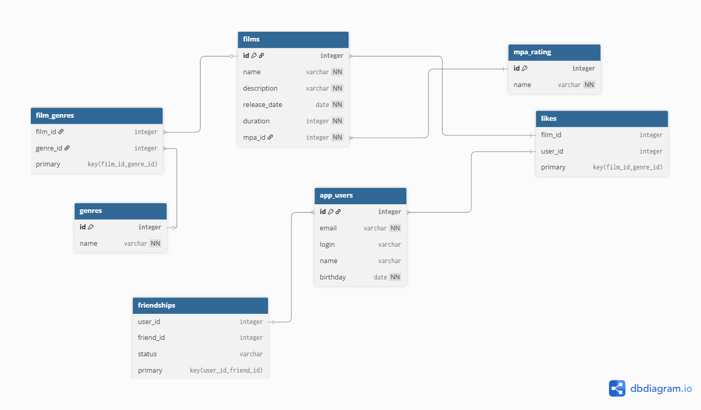

# Filmorate

Социальная сеть для любителей кино с возможностью оценивать фильмы, добавлять друзей и получать рекомендации. Проект позволяет пользователям ставить лайки фильмам, оставлять отзывы и находить новые интересные картины на основе предпочтений друзей.

**Стек технологий:** Java 11+, Spring Boot, Spring JDBC, H2 Database, Maven, Lombok, Logbook

## Основные возможности

- **Управление фильмами** — добавление, обновление и получение информации о фильмах (название, описание, дата релиза, продолжительность, рейтинг MPA, жанры)
- **Пользователи** — регистрация, обновление профиля, добавление в друзья, подтверждение дружбы
- **Лайки и рейтинг** — возможность ставить лайки фильмам, получение топа популярных фильмов
- **Рекомендации** — подбор фильмов на основе предпочтений друзей и собственных оценок
- **Жанры и рейтинги MPA** — справочная информация для классификации фильмов

## Схема базы данных

[Полный файл диаграммы в формате dbml](docs/filmorate.dbml)

### Структура таблиц

- **users** — пользователи платформы (email, логин, имя, дата рождения)
- **films** — фильмы (название, описание, дата релиза, продолжительность, рейтинг MPA)
- **mpa_rating** — справочник рейтингов MPA (G, PG, PG-13, R, NC-17)
- **genres** — справочник жанров (комедия, драма, боевик и т.д.)
- **film_genres** — связь фильмов и жанров (многие ко многим)
- **likes** — лайки фильмов от пользователей
- **friendships** — дружба между пользователями со статусом (PENDING, CONFIRMED)

## Выводы
В результате разработки создано полнофункциональное приложение для работы с базой данных фильмов и пользователей. Реализована гибкая система дружбы с подтверждением, механизм лайков и рейтингования фильмов. Продумана структура БД с учетом всех связей и ограничений. Проект покрыт логированием через Logbook для удобства отладки и мониторинга.

## Развертывание и системные требования
### Требования
- Java 11 или выше
- Maven
- Git

### Запуск
#### Клонирование репозитория
git clone https://github.com/tubashov/java-filmorate.git  
cd java-filmorate

#### Сборка проекта
mvn clean install

#### Запуск приложения
mvn spring-boot:run

## Topics
java spring-boot h2-database jdbc film-rating social-network maven lombok
